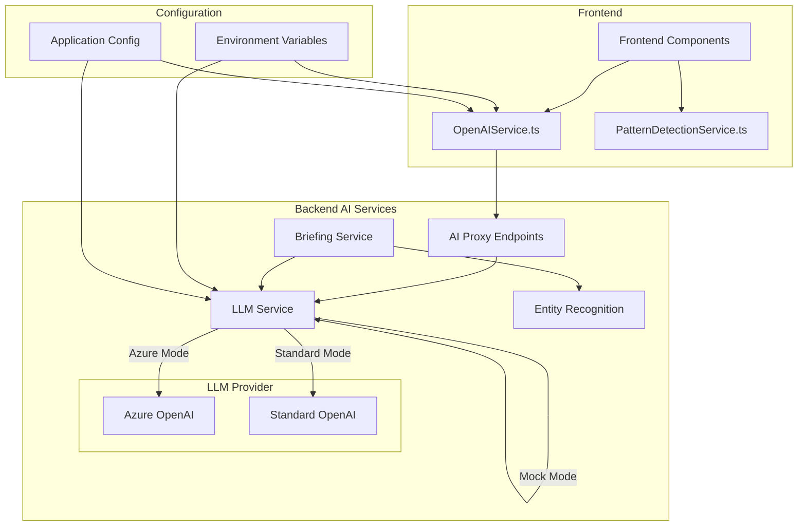
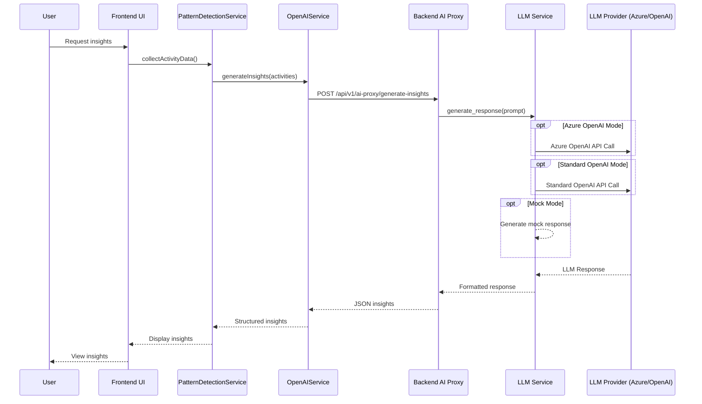
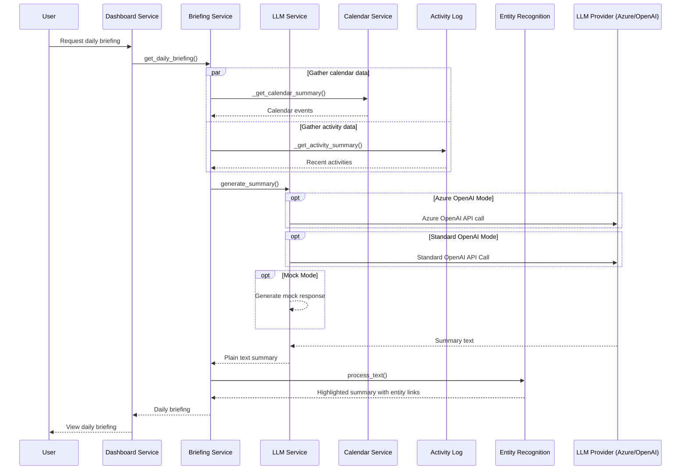

# AI Service Architecture - Biosphere Alpha

## Overview

The Biosphere Alpha platform integrates AI capabilities through a secure and flexible architecture that supports both OpenAI and Azure OpenAI services while maintaining proper security practices. The AI integration enables advanced features such as insights generation, daily briefings, sentiment analysis, and entity recognition throughout the application.

This document provides a comprehensive overview of the AI service architecture, including components, data flow, security considerations, and implementation details.

## Architecture Diagram



## Component Breakdown

### 1. Frontend Components

#### OpenAIService.ts
- **Purpose**: Client-side service that communicates with the backend AI proxy endpoints
- **Key Features**:
  - Prevents direct OpenAI API calls from the frontend for security
  - Routes all AI requests through backend proxy endpoints
  - Provides graceful fallbacks and mock responses for development
  - Handles development vs production modes
  - Implements timeout handling and error recovery

#### PatternDetectionService.ts
- **Purpose**: Processes user activities and data for insight generation
- **Key Features**:
  - Collects and preprocesses user activity data
  - Sends structured data to OpenAIService for analysis
  - Organizes insights into relevant categories

### 2. Backend AI Proxy

The backend AI proxy layer consists of FastAPI endpoints that handle all communication with AI services, ensuring:

- API keys remain secure on the server side
- Proper request validation and error handling
- Consistent response formatting
- Rate limiting and token usage optimization

#### AI Proxy Endpoints

| Endpoint | Purpose | Methods |
|----------|---------|---------|
| `/api/v1/ai-proxy/summarize-insights` | Generates summaries from insight collections | POST |
| `/api/v1/ai-proxy/enhance-insight` | Improves a single insight with additional context | POST |
| `/api/v1/ai-proxy/generate-insights` | Creates new insights from activity data | POST |
| `/api/v1/ai-proxy/custom-prompt` | Processes arbitrary prompts for flexible AI usage | POST |

### 3. Core Backend AI Services

#### LLM Service (llm_service.py)
- **Purpose**: Core service for AI model interactions
- **Key Features**:
  - Provider abstraction layer supporting both OpenAI and Azure OpenAI
  - Fallback to mock responses when API keys aren't available
  - Comprehensive error handling and logging
  - Connection testing and diagnostic capabilities
  - Token usage optimization

#### Briefing Service (briefing_service.py)
- **Purpose**: Generates personalized daily briefings for users
- **Key Features**:
  - Integrates calendar data from Google and Microsoft providers
  - Incorporates recent user activity from logs
  - Creates concise, contextual daily summaries
  - Uses entity recognition to enhance output

#### Entity Recognition Service
- **Purpose**: Identifies and links entities in text to database records
- **Key Features**:
  - Processes text to identify mentions of users, teams, projects, etc.
  - Creates interactive elements from plain text
  - Enhances AI-generated content with application context

## Data Flow

### Insight Generation Flow



### Briefing Generation Flow



## Security Considerations

### API Key Management

The architecture strictly follows security best practices for API key management:

1. **No Frontend Exposure**: API keys are never exposed to the frontend or included in client-side code
2. **Environment Variables**: All sensitive credentials are stored in server-side environment variables
3. **Backend-Only Access**: All AI model API calls are proxied through backend endpoints
4. **Redacted Logging**: API keys are never logged in plain text, even in debug mode

### Request Validation

Requests to AI services are validated at multiple levels:

1. **Frontend**: Basic input validation before sending to backend
2. **Backend Proxy**: Comprehensive input validation and sanitization
3. **LLM Service**: Additional validation before making external API calls
4. **Rate Limiting**: Protection against excessive API usage

## Configuration Options

The AI service can be configured through environment variables in both frontend and backend:

### Backend Environment Variables

| Variable | Description | Default |
|----------|-------------|---------|
| `OPENAI_API_KEY` | API key for OpenAI services | None |
| `OPENAI_IS_AZURE` | Flag to use Azure OpenAI (true/false) | false |
| `AZURE_OPENAI_ENDPOINT` | Azure OpenAI endpoint URL | None |
| `AZURE_OPENAI_DEPLOYMENT` | Azure OpenAI deployment name | gpt-4 |
| `AZURE_OPENAI_API_VERSION` | Azure API version | 2023-05-15 |
| `OPENAI_MODEL` | Model for standard OpenAI | gpt-3.5-turbo |
| `DISABLE_OPENAI` | Flag to disable OpenAI and use mock mode | false |

### Frontend Environment Variables

| Variable | Description | Default |
|----------|-------------|---------|
| `VITE_OPENAI_IS_AZURE` | Flag to use Azure OpenAI (true/false) | false |
| `VITE_AZURE_OPENAI_ENDPOINT` | Azure OpenAI endpoint URL | None |
| `VITE_AZURE_OPENAI_DEPLOYMENT` | Azure OpenAI deployment name | gpt-4 |
| `VITE_OPENAI_MODEL` | Model for standard OpenAI | gpt-4o |

## Development and Mock Mode

The architecture includes a comprehensive mock mode for development:

- Automatically activated when `DISABLE_OPENAI` is true or `OPENAI_API_KEY` is not set
- Provides realistic mock responses for all AI endpoints
- Simulates AI functionality without making actual API calls
- Development-specific flag `dev_mode` in localStorage for frontend testing

## Implementation Details

### LLM Service Singleton

The LLM service is implemented as a singleton pattern to ensure consistent configuration and resource management:

```python
# Instantiate the service once
llm_client = LLMClient()

class LLMService:
    _client: AsyncOpenAI | AsyncAzureOpenAI | None = None
    _mock_mode: bool = False
    _model: str = "gpt-3.5-turbo"
    _is_azure: bool = False

    @classmethod
    def get_client(cls):
        # Implementation details...
        
# Create a singleton instance
llm_service = LLMService()
```

### Error Handling Strategy

The architecture implements a multi-layered error handling strategy:

1. **Service Layer**: LLM service catches and logs errors, returning informative error messages
2. **API Layer**: Proxy endpoints handle errors from the service layer and return appropriate HTTP responses
3. **Client Layer**: Frontend services handle API errors gracefully with fallback content
4. **UI Layer**: Components handle error states with appropriate user feedback

### Azure OpenAI Integration

Azure OpenAI support is fully integrated with:

- Dynamic endpoint configuration
- API version specification
- Deployment name mapping to model names
- Azure-specific authentication

## BMS Azure OpenAI Integration

The system is currently integrated with BMS Azure OpenAI services:

- **Endpoint**: `https://bms-openai-services-eastus2-1-nonprod.azu.bms.com`
- **Model**: `gpt-4.1-mini`
- **API Version**: `2023-05-15`

## Future Enhancements

Planned enhancements to the AI architecture include:

1. **Advanced Caching**: Implement result caching for common queries to reduce API calls
2. **Streaming Responses**: Add support for streaming responses for longer outputs
3. **Function Calling**: Implement OpenAI function calling for more structured outputs
4. **Fine-tuned Models**: Support for custom fine-tuned models specific to organizational needs
5. **Enhanced Analytics**: Track and analyze AI usage patterns and effectiveness

## Conclusion

The AI service architecture in Biosphere Alpha provides a secure, flexible foundation for AI-powered features, enabling advanced insights, briefings, and content generation while maintaining proper security practices and ensuring graceful degradation when services are unavailable.