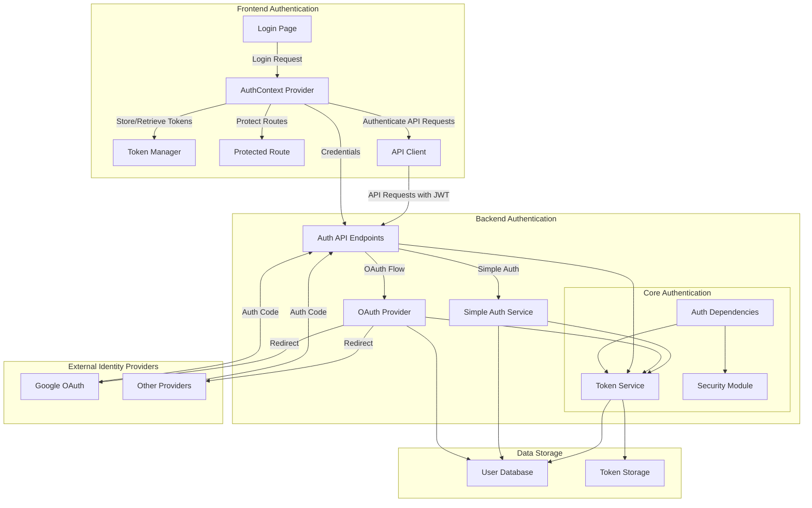
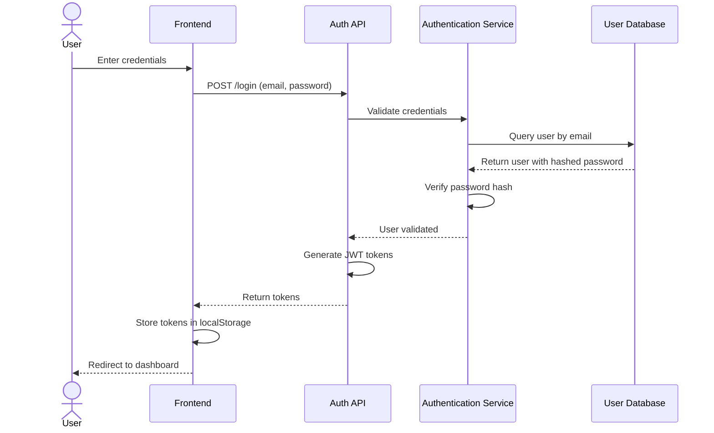
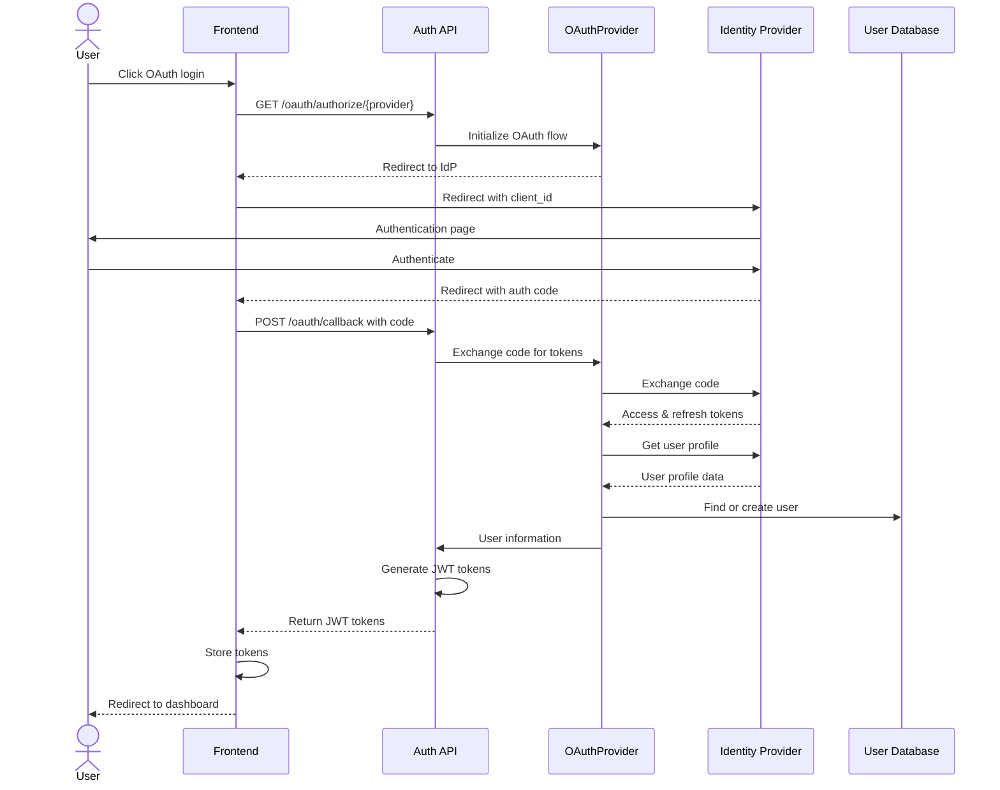
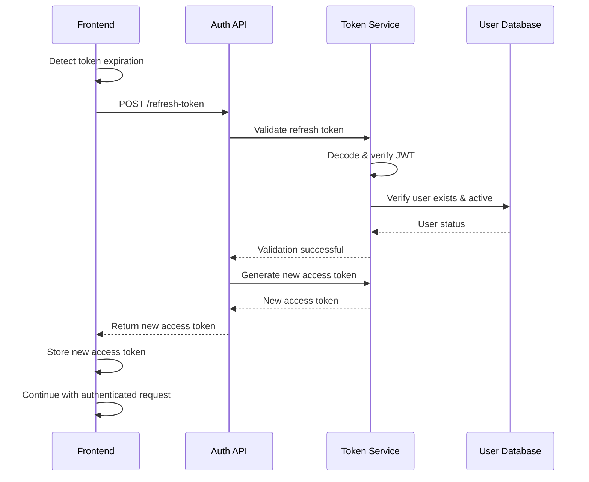
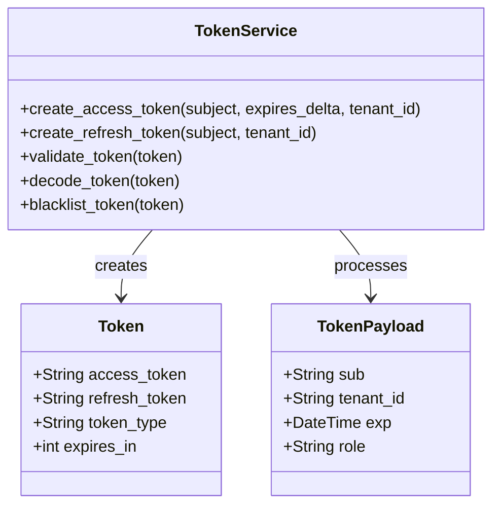
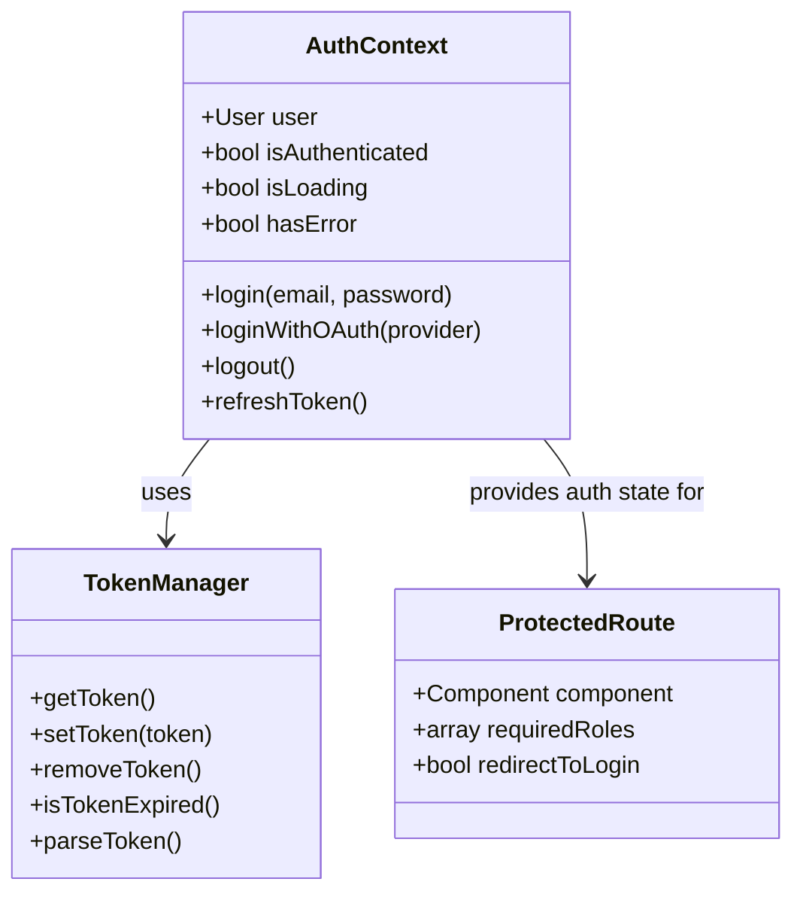
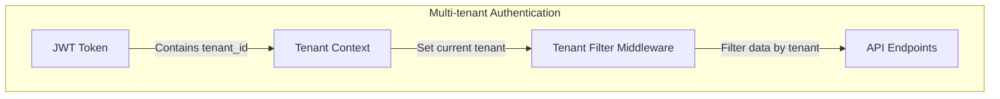
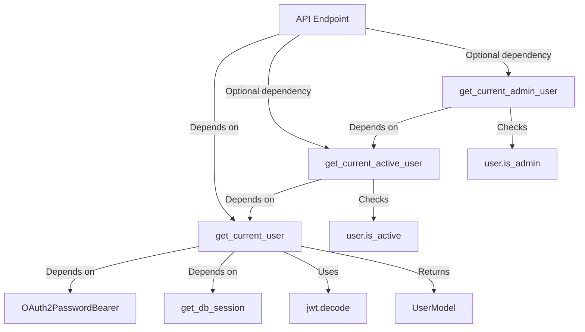

# Authentication System Architecture - Biosphere Alpha

## Overview

The Biosphere Alpha platform utilizes a sophisticated multi-tenant JWT-based authentication system that supports both traditional password authentication and OAuth integration. This document provides a comprehensive overview of the authentication architecture, detailing the flow of authentication requests, token management, multi-tenant support, and security considerations.

## Architecture Diagram



## Authentication Flows

### 1. Password-Based Authentication Flow



### 2. OAuth Authentication Flow



### 3. Token Refresh Flow



## Core Components

### 1. Token Management

The authentication system uses JSON Web Tokens (JWT) for secure, stateless authentication:



#### Key Features:
- **Dual Token System**: Short-lived access tokens (30 minutes) and longer-lived refresh tokens
- **Tenant Isolation**: Tenant ID embedded in token payload
- **Role-Based Access**: User roles included in token for authorization
- **Secure Signing**: HMAC-SHA256 algorithm with server-side secret key

### 2. Frontend Authentication Context



#### Key Features:
- **Global Auth State**: React context provides authentication state throughout the application
- **Secure Token Storage**: LocalStorage with session storage fallback
- **Route Protection**: Components for restricting access to authenticated users
- **Login Methods**: Support for both password and OAuth authentication flows

### 3. Multi-tenant Authentication



#### Key Features:
- **Tenant Context**: JWT token contains tenant ID for context establishment
- **Data Isolation**: Middleware enforces tenant-specific data access
- **Transparent Handling**: Applications code doesn't need to handle tenant filtering
- **Validation**: Checks ensure users only access their assigned tenant's data

### 4. Authentication Dependencies



#### Key Features:
- **Dependency Injection**: FastAPI dependency system for clean authentication flows
- **Role Verification**: Separate dependencies for different access levels
- **Tenant Context**: Automatic tenant context establishment from token
- **Error Handling**: Consistent HTTP status codes for authentication failures

## Key Authentication Implementations

### 1. Backend Authentication Services

#### Simple Auth Service
The SimpleAuthService provides traditional username/password authentication:

```python
class SimpleAuthService:
    async def authenticate_user(
        self, db: AsyncSession, email: str, password: str
    ) -> Optional[User]:
        """Authenticate a user with email and password"""
        user = await crud_user.get_by_email(db, email=email)
        
        if not user:
            return None
        
        if not verify_password(password, user.hashed_password):
            return None
            
        return user
        
    async def create_tokens_for_user(
        self, user_id: UUID, tenant_id: UUID
    ) -> Dict[str, str]:
        """Create access and refresh tokens for a user"""
        access_token = create_access_token(
            subject=user_id, tenant_id=tenant_id
        )
        
        refresh_token = create_refresh_token(
            subject=user_id, tenant_id=tenant_id
        )
        
        return {
            "access_token": access_token,
            "refresh_token": refresh_token,
            "token_type": "bearer"
        }
```

#### OAuth Provider
The OAuth provider system enables authentication through external identity providers:

```python
class OAuthProvider:
    def __init__(self, registry):
        self.registry = registry
        
    def get_provider(self, name: str):
        """Get a specific OAuth provider configuration"""
        return self.registry.get(name)
        
    async def handle_callback(
        self, request: Request, provider_name: str, db: AsyncSession
    ):
        """Process OAuth callback and authenticate user"""
        provider = self.get_provider(provider_name)
        token = await provider.exchange_code(request)
        
        userinfo = await provider.get_userinfo(token)
        email = userinfo.get("email")
        
        # Find or create user based on OAuth information
        user = await crud_user.get_by_email(db, email=email)
        if not user:
            user = await self._create_user_from_oauth(db, userinfo)
            
        # Generate authentication tokens
        return await create_tokens_for_user(user.id, user.tenant_id)
```

### 2. Frontend Authentication Management

#### AuthContext Provider
The AuthContext provides global authentication state management:

```typescript
export const AuthContext = createContext<AuthContextType>({
  user: null,
  isAuthenticated: false,
  isLoading: true,
  hasError: false,
  login: async () => {},
  loginWithOAuth: async () => {},
  logout: () => {},
  refreshToken: async () => {},
});

export const AuthProvider: React.FC<{children: React.ReactNode}> = ({ children }) => {
  const [user, setUser] = useState<User | null>(null);
  const [isAuthenticated, setIsAuthenticated] = useState<boolean>(false);
  const [isLoading, setIsLoading] = useState<boolean>(true);
  const [hasError, setHasError] = useState<boolean>(false);
  
  // Manages token refresh and session persistence
  useEffect(() => {
    const initAuth = async () => {
      try {
        const token = TokenManager.getToken();
        
        if (token && !TokenManager.isTokenExpired()) {
          await fetchUserData();
        } else if (token && TokenManager.isTokenExpired()) {
          await refreshToken();
        } else {
          setIsLoading(false);
        }
      } catch (error) {
        console.error("Authentication initialization error:", error);
        setHasError(true);
        setIsLoading(false);
      }
    };
    
    initAuth();
  }, []);
  
  const login = async (email: string, password: string): Promise<boolean> => {
    try {
      setIsLoading(true);
      
      const response = await apiClient.post('/auth/login', { 
        email, 
        password 
      });
      
      TokenManager.setToken(response.data.access_token);
      await fetchUserData();
      
      return true;
    } catch (error) {
      setHasError(true);
      return false;
    } finally {
      setIsLoading(false);
    }
  };
  
  // Additional authentication methods...
  
  return (
    <AuthContext.Provider
      value={{
        user,
        isAuthenticated,
        isLoading,
        hasError,
        login,
        loginWithOAuth,
        logout,
        refreshToken,
      }}
    >
      {children}
    </AuthContext.Provider>
  );
};
```

#### Token Manager
The TokenManager handles secure token storage and parsing:

```typescript
export class TokenManager {
  private static readonly TOKEN_KEY = 'auth_token';
  private static readonly REFRESH_TOKEN_KEY = 'refresh_token';
  
  static getToken(): string | null {
    try {
      return localStorage.getItem(this.TOKEN_KEY) || sessionStorage.getItem(this.TOKEN_KEY);
    } catch (e) {
      return sessionStorage.getItem(this.TOKEN_KEY);
    }
  }
  
  static setToken(token: string): void {
    try {
      localStorage.setItem(this.TOKEN_KEY, token);
    } catch (e) {
      sessionStorage.setItem(this.TOKEN_KEY, token);
    }
  }
  
  static removeToken(): void {
    try {
      localStorage.removeItem(this.TOKEN_KEY);
      localStorage.removeItem(this.REFRESH_TOKEN_KEY);
    } catch (e) {
      // Fallback
    }
    
    sessionStorage.removeItem(this.TOKEN_KEY);
    sessionStorage.removeItem(this.REFRESH_TOKEN_KEY);
  }
  
  static parseToken(): any {
    const token = this.getToken();
    
    if (!token) {
      return null;
    }
    
    try {
      // JWT tokens are base64 encoded in 3 parts: header.payload.signature
      const base64Url = token.split('.')[1];
      const base64 = base64Url.replace(/-/g, '+').replace(/_/g, '/');
      
      return JSON.parse(window.atob(base64));
    } catch (error) {
      console.error('Error parsing token:', error);
      return null;
    }
  }
  
  static isTokenExpired(): boolean {
    const payload = this.parseToken();
    
    if (!payload || !payload.exp) {
      return true;
    }
    
    // exp is in seconds, Date.now() is in milliseconds
    return payload.exp * 1000 < Date.now();
  }
}
```

## Security Considerations

### 1. JWT Security Measures

- **Short-lived Tokens**: Access tokens expire after 30 minutes to limit risk
- **Secure Signing**: HMAC-SHA256 algorithm with server-side secret key
- **Token Scope**: Minimal claims in the token payload for security
- **Refresh Token Management**: Longer-lived, but securely stored and rotated

### 2. Password Security

- **Bcrypt Hashing**: Passwords are hashed using bcrypt with automatic salt generation
- **Password Strength**: Enforces minimum complexity requirements
- **Brute Force Protection**: Rate limiting on authentication endpoints
- **No Plaintext Storage**: Passwords never stored or logged in plaintext

### 3. Cross-Site Request Forgery (CSRF) Protection

- **SameSite Cookies**: When cookies are used, they use SameSite attribute
- **CSRF Tokens**: For state-changing operations in forms
- **Custom Headers**: API requests include custom headers that simple CSRF can't replicate

### 4. HTTP Security Headers

```python
@app.middleware("http")
async def add_security_headers(request: Request, call_next):
    response = await call_next(request)
    
    # Add security headers
    response.headers["X-Content-Type-Options"] = "nosniff"
    response.headers["X-Frame-Options"] = "DENY"
    response.headers["X-XSS-Protection"] = "1; mode=block"
    response.headers["Strict-Transport-Security"] = "max-age=31536000; includeSubDomains"
    
    return response
```

## Multi-tenant Support

### 1. Tenant Identification and Isolation

- **Token-based Tenant ID**: JWT contains the tenant_id claim
- **Middleware Filtering**: All database queries filtered by tenant_id automatically
- **Tenant Validation**: Ensures users only access their assigned tenant

```python
@router.middleware("http")
async def tenant_filter_middleware(request: Request, call_next):
    # Extract token and set tenant context
    token = extract_token_from_request(request)
    
    if token:
        try:
            payload = jwt.decode(token, settings.SECRET_KEY, algorithms=[settings.ALGORITHM])
            tenant_id = payload.get("tenant_id")
            
            if tenant_id:
                # Set the tenant context for this request
                tenant_context.set(tenant_id)
        except:
            # If token is invalid, no tenant context is set
            pass
    
    response = await call_next(request)
    
    # Clear tenant context after the request is processed
    tenant_context.clear()
    
    return response
```

### 2. Demo Tenant Authentication

```python
@router.post("/login/demo", response_model=schemas.Token)
async def login_demo(
    tenant_id: str = Body(...),
    db: AsyncSession = Depends(deps.get_db_session)
) -> Any:
    """
    Demo login for development and testing.
    Creates or uses demo users for specified tenants.
    """
    # Validate tenant exists
    tenant = await crud_tenant.get_by_slug(db, slug=tenant_id)
    
    if not tenant:
        raise HTTPException(
            status_code=404,
            detail=f"Tenant {tenant_id} not found"
        )
    
    # Get or create demo user for this tenant
    demo_user = await create_or_get_demo_user(db, tenant.id)
    
    # Generate tokens for the demo user
    tokens = await simple_auth_service.create_tokens_for_user(
        demo_user.id, tenant.id
    )
    
    return tokens
```

## Error Handling

### 1. Authentication Error Responses

```python
# Backend error handling for auth failures
credentials_exception = HTTPException(
    status_code=status.HTTP_401_UNAUTHORIZED,
    detail="Could not validate credentials",
    headers={"WWW-Authenticate": "Bearer"},
)

# Permission errors
permission_exception = HTTPException(
    status_code=status.HTTP_403_FORBIDDEN,
    detail="Not enough permissions",
)

# Tenant access errors
tenant_mismatch_exception = HTTPException(
    status_code=status.HTTP_403_FORBIDDEN,
    detail="User does not belong to the specified tenant",
)
```

### 2. Frontend Error Handling

```typescript
try {
  await login(email, password);
  navigate('/dashboard');
} catch (error) {
  if (error instanceof AppError) {
    switch (error.category) {
      case ErrorCategory.AUTHENTICATION:
        setError('Invalid username or password');
        break;
      case ErrorCategory.NETWORK:
        setError('Network error. Please check your connection.');
        break;
      case ErrorCategory.SERVER:
        setError('Server error. Please try again later.');
        break;
      default:
        setError('An unexpected error occurred');
        break;
    }
  } else {
    setError('An unexpected error occurred');
  }
}
```

## Integration with API Client

The authentication system integrates with the API client to ensure all requests are authenticated:

```typescript
// API client with authentication
const apiClient = axios.create({
  baseURL: VITE_API_BASE_URL,
  timeout: 30000,
});

// Request interceptor to add authentication header
apiClient.interceptors.request.use(
  (config) => {
    const token = TokenManager.getToken();
    
    if (token) {
      config.headers['Authorization'] = `Bearer ${token}`;
    }
    
    return config;
  },
  (error) => {
    return Promise.reject(error);
  }
);

// Response interceptor to handle authentication errors
apiClient.interceptors.response.use(
  (response) => {
    return response;
  },
  async (error) => {
    const originalRequest = error.config;
    
    // Handle 401 Unauthorized error
    if (
      error.response &&
      error.response.status === 401 &&
      !originalRequest._retry
    ) {
      originalRequest._retry = true;
      
      try {
        // Try to refresh token
        await refreshToken();
        
        // Update authorization header with new token
        const token = TokenManager.getToken();
        originalRequest.headers['Authorization'] = `Bearer ${token}`;
        
        // Retry the original request
        return apiClient(originalRequest);
      } catch (refreshError) {
        // If refresh fails, redirect to login
        TokenManager.removeToken();
        window.location.href = '/login';
        return Promise.reject(refreshError);
      }
    }
    
    return Promise.reject(error);
  }
);
```

## Conclusion

The authentication system in Biosphere Alpha provides a robust, secure, and flexible foundation for user authentication and authorization. The system supports both traditional password authentication and OAuth integration, with a focus on multi-tenant isolation and security. The JWT-based token system ensures stateless authentication while maintaining proper security measures.

The architecture is designed to be maintainable, with clear separation of concerns between different components. The frontend authentication context provides global access to authentication state, while the backend services handle token generation, validation, and user authentication. The system is also designed with security in mind, implementing best practices for password storage, token handling, and protection against common web vulnerabilities.

As the platform continues to evolve, the authentication system can be extended to support additional authentication methods and enhanced security features while maintaining backward compatibility with existing implementations.